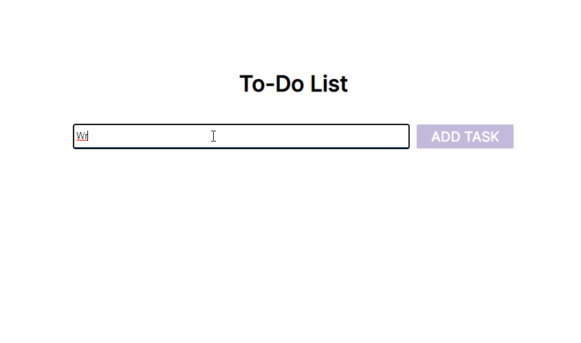

# To-Do List 

One of the projects on [JetBrains Academy](https://www.jetbrains.com/academy/) Frontend Developer track. 

## Functionality
You can add tasks, mark them as completed and delete them. Tasks are saved in localStorage, so they are still there even after page reload.

## Stack:  
* HTML
* CSS
* JS: event listeners, work with local storage
  
## Demo:  

Github Pages (saves your to-dos in localStorage):
[https://tropnikov.github.io/to-do-list/](https://tropnikov.github.io/to-do-list/)  

Example of work:

  

## Plans
- Check markup for mobile devices
 